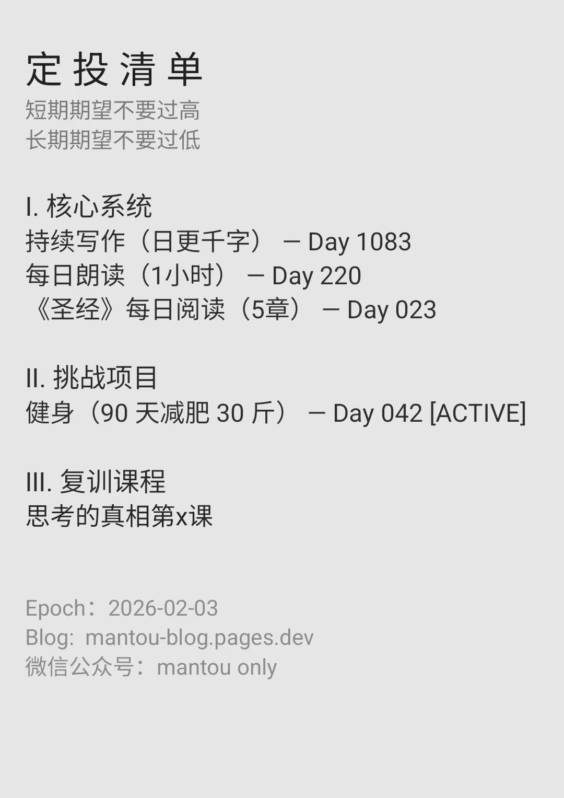

为了完成对自己的产品迭代承诺，昨晚七点钟开始一直肝到凌晨一点多钟，在电脑手机和人脑给通通干的没电后，我不得不去休息一下来调整自己的状态。在早上八点醒来后，我没有赖床的任何意愿，没完成的“遗志”把我整个人从床上拉了起来，匆匆忙忙地跑去电脑前继续干。最终还是在依靠 *Codex 的“神力”* 给完成了昨天所有任务中的最后一环：**完成了可以实时查看本博客网站后台数据的脚本配置。**

现在回顾起来，反而并没觉得有什么。但在过去的那个睡梦中，自己连做梦都是拼命三郎般工作状态下的成龙龙叔形象。或许是因为前方还有更多更重要的事情需要自己急着去做，以至于没有过多的情绪被花在“自我鼓励”的状态下吧！

今天中午坐在草坪上看书的我，思绪同样是活蹦乱跳着。突然某个时刻，自己便顿悟了。**“好像自己太过于沉浸于只学不练的状态，以至于忽视了更重要的事情：为了造而学而练”。**

于是突然间便发觉到：现在好多事情瞬间变得不太重要了。但与此同时，自己的大脑开始飞快地运行着，得出另一个结论：**学和造的比例严重失调……**
于是基于这般的想法，我写了篇公众号文章来梳理自己的想法：

> 「当成长开始变得过于平静」
> 
> 我本人有份定投清单，
> 这是一份日更频率级别的清单列表：
> ps：图附在文尾
> 每天我都会通过这份清单，
> 或“逼迫”或“记录”式地快照自己每天的“成长”轨迹。
> 
> 说来也挺尴尬的。
> 本来是一个 super 级别的 idea ，
> 可在越来越多人的围观下：
> 这“聚光灯”的灯光似乎也越发地灼眼，
> 使得自己的动作开始潜移默化间有所变形…
> 
> 最明显的一个感觉就是
> 由于整个时间线过久，
> 自己的清单内容又过于“如湖面般的平静”，
> 进而使得越来越多的读者开始习惯于我这样做。
> 
> 我当然可以一直这样做下去了，
> 毕竟这于我而言早已是一种“习惯”，
> 一件自然而然的事情…
> 
> 可读者并不可能一直这样持续看下去嘛，
> 更别说去奢望来自于大量
> 外界的“持续反馈”了…
> 
> 于是本着这样的思考角度，
> 在与 ChatGPT 沟通过后，
> 我终于还是决定要去做一些：
> 新的、大的且足够好玩的事情。
> 
> 原本定投清单列表事项主要包括：
> 读书、健身、写作和学习等事项
> 但这些词汇也确实一个比一个模糊，
> 进而滋生出了不少”罪恶的懒惰“出来…
> 
> 那接下来要怎么做？
> 就是要朝着“生产产品”的方向去做。
> 于是我把新版的定投清单事项主要分为两类：
> “快交付”和“慢输入”。
>
> 周一至周五采用碎片化时间阅读和构思产品，
> 周六、周天采用整块时间来做生产
> 每个月至少交付一个产品。
> 
> 想想看，
> 在这般调整优化后，
> 未来那该多有趣呐！

在写完以上文段后的我，深感欣慰。
因为**自己没有欺骗自己，也尽可能全透明般地活在了读者面前。**
*毕竟相较于出丑于众而已，*
*获取到试错后的成功做事经验才重要……*

