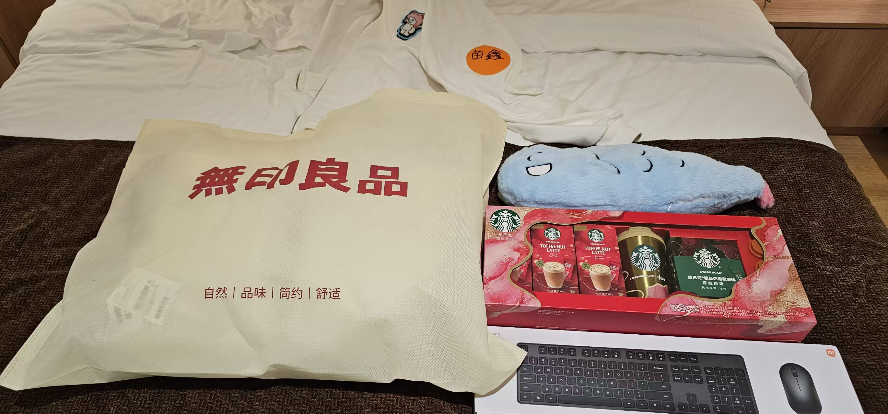

+++
date = '2026-02-08T20:01:01+08:00'
draft = false
title = '把人生当作一场长期下注'
+++ 

在二十出头的这个年龄阶段，对于野心勃勃的人来说，就是一次次拳头打在沙包上，都见不到BOOS掉血条的尴尬时期。而对于我这种人来说，也同样不例外。可几次过后，自己还是选择冷静下来去思考：自己更需要做出哪些调整才更容易走出破局。说到底就是什么更重要？什么最重要？

遇到难事冷静思考而后做出行动调整也并非我个人的“专利”。只不过相较于其他人来说，我这个人更容易选择做更对也同样更难的事。愿意长时间投注于其中而又不断地优化和修改，直至最终的胜利。

观察过很多身边同龄人，在做事时并不够专业，以至于早早地沦为普通人。可做的专业也并非最终做成事的唯一原因，因为有人靠其它因素也扶摇直上以至于成功。可这样的人终究凤毛麟角……

同样，当那些做的好的人在不得不做出新的选择时，也并不见得可以做出更好的选择在下一次的选择上。更别提连做都做不好的人，其后做的正确的选择的概率了。

于是选择错了，很多人同样会因此一落千丈。举个例子：其实这个世界上的每个人都在做着炒股工作。考研大军在赌未来的学历更值钱；考公大军在押注未来几十年里生活稳定更有保证；贷款买房炒房的人在押注当地未来三十年当地的经济发展。而以上这几个选择在有些人眼中确确实实不是一个好的选择。于是不同选择的人当然会出现不同的表现，进而导致不同的人生。

我是说，不要过于轻易地对“大众选择”做出缴械投降的行动。总有更重要的事情要做，那就是要时不时地做出新的思考对于任何关乎未来的重要选择上。

我是说无论大事还是小事。此刻我有必要举两个例子来具体说明一下：
第一个是在2022年的时候，当我开始接触区块链的落地产品NFT时，自己常常被别人当“韭菜”給割。这让我很不爽。于是在简单思考后我便决定以着专业的玩家角度来参与。后来也确实是，在后来的快一年的时间里，我不仅看了不少资深的区块链技术书籍，而且还直接真金白银地参与了其中。当时并不知道那些改变会给我带来些什么样的结果，直到后来靠那些知识，让我成功地变现了一部分资金以资助我自己在最青春年少时期到日本去旅行，让我度过了人生中最富足的一次旅行时光。

再后来就是今天的一件小事情。公司年会时期，让我们自我介绍。做过八百遍的自我介绍的我当然知道这么简单的描述有多重要。于是到我的时候，我先是走上前台，后又以着一副处事不惊的幽默风格自我介绍了一遍，而后又按照宇宙吸引力法则，给了自己一个极强的积极心理暗示。那就是当着所有人的面发誓说我所在的小组一定可以拿到第一。

结果一个多小时后，我们组不仅拿到了全场最佳表现小组成绩，而且连我个人也拿到了全场最佳。全场我最喜欢的奖品我都尽收囊中……

