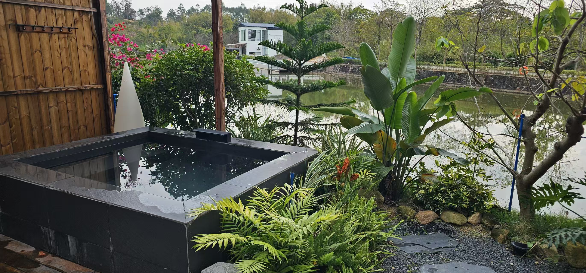
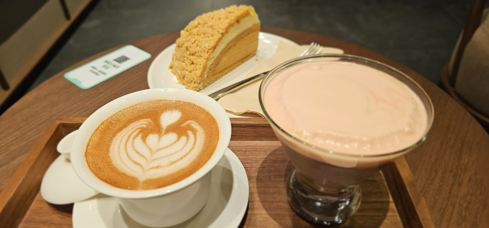

+++
date = '2026-02-09T20:01:01+08:00'
draft = false
title = '在温泉里，我依然没能完全松下来'
+++ 

今天竭力起了个大早，特意为了吃个早餐而如此的。结果又突然发现还可以泡温泉，于是趁着大家还没起床的我“蹑手蹑脚”地跑去抢位置。后来才意外地发现，从我开始泡温泉一直到结束竟然都无一人光临“温泉”之地。在泡完后问及他们时，他们似乎仍然对此表现的无动于衷。摇头且惊叹地说那么冷的天哪里受得了。

可去之前的我也是如此这般想法，可泡完之后的我就完全否决了这样的看法。因为一边在泡，一边又在感慨，自己竟然没有感到任何的凉意所在。或许进入温泉的速度过快所致？可从温泉里走出来的我，竟然一点冷都没有感知到。浑身温热的我，通过温红的肤色已经表现了出来。体感在告知我，自己的耐寒度已经提升了许多。

事后通过搜索才知道，冬天泡温泉最宜。泡温泉可以疏通血管、消除疲劳和提升耐寒度。虽然这也不是第一次泡温泉，但露天泡温泉，这确实是第一次。不过下次要我再选的话，我还会选择露天的温泉。这让我感觉更天然！

在泡温泉的时候，自己有一个很明显的感觉，那就是尽管自己试图着让自己在放松地体验一下泡温泉的全过程，可自己屡次尝试后还是无法成功。

总感觉心里有事，自己无法更好地卸下那心中的重担，松下自己原本紧绷的神经来好好放松一下。这样确实并不好，因为最后下来才发现，自己并没有因为没有放松体验当下而错失掉什么。一切都是自己心里的👻在作祟。

其实不仅仅这一件事。在昨晚K歌的时候，自己也想放开膀子来唱来跳。结果呢，结果自己只是心里如此想了想，最终还是没有真正落地。就是自己常常会在很多场合下保持着紧绷感，过于容易警惕，无法真正沉浸在某个氛围中来做事。

或许这样的状态在某些情况是好的，可在自己去放松休息娱乐时，自己仍然没有放松下来去体验，事后再想起来时，其实还是挺惋惜的。正是因为有这样的感触，也使得我更容易被那些能够很自如地放松娱乐的人深感羡慕和钦佩。时长久了，我也常常会发出这样的感慨，大概这就是一种能力吧……

在更深入且长期地对那些人的观察后，自己会很容易发现到一点，那就是那些人更容易成功。比如做销售工作的，那么他们是全国销售top级别的销售员；做知识传播的人，那么他们就是教授级别的存在；亦或者做企业的人，他们更容易做到成功世界的顶级……

这样的能力似乎是需要相当的认知和觉知的。就好像我在昨天玩乐时还在羞涩与别人打交道，可在我意识到这一切都不过是一场游戏时，我就好像突然顿悟了一番。那一刻：有的是一场大汗淋漓般的痛快……

写在最后，还是极力想分享一下我今天喝到的星爸爸咖啡套餐：“岭南双重奏”！
