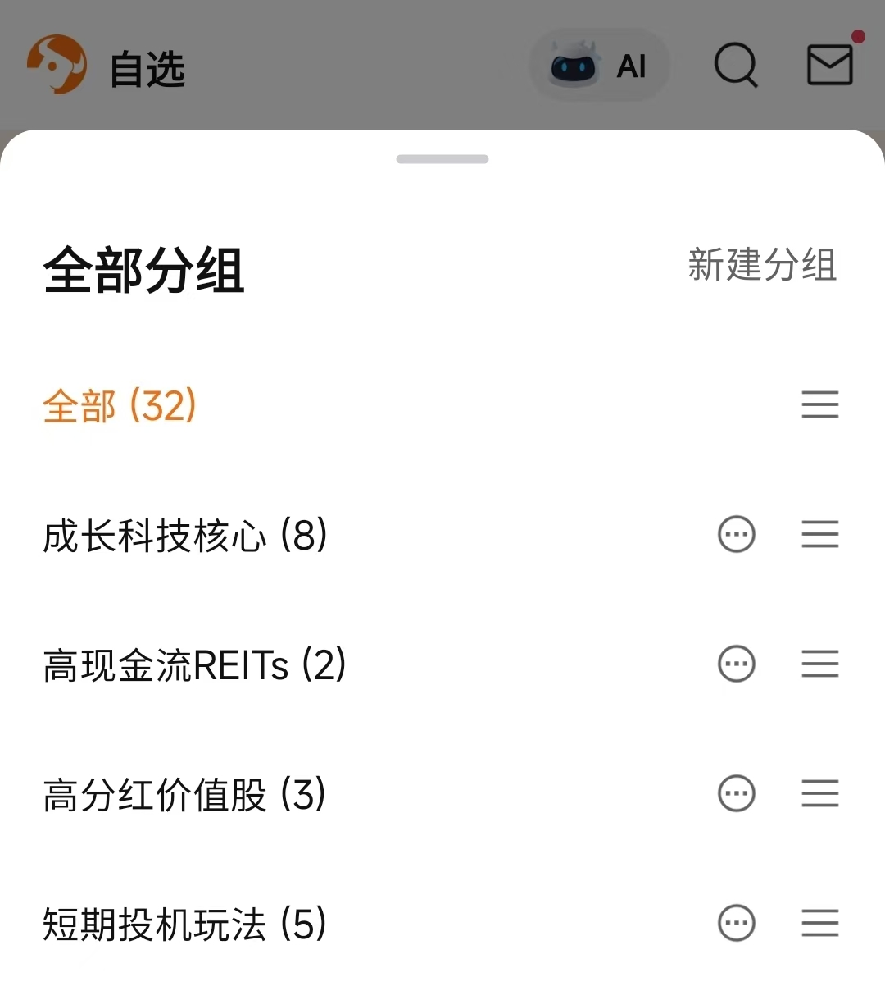

+++
date = '2026-02-11T17:46:01+08:00'
draft = false
title = '进一步的优化工作'
+++ 

就昨天的问题，今天进行了特意的调整和优化。不过不是针对以上每一项来逐个划分，而是依据以上三个内容的共性——时间安排不合理的问题，进行了一通较为严肃的反思。

诚实地来说，过去那连24小时都不到的时间绝对不够，因此我采取退而求其次的方法，就其中的某个点进行了认真的审视：再次大幅缩减自己每日做的事情数量。根据“是否是以生产为导向”的判断标准，我需要对其中的很多事情进行进一步的大裁决。如无必要，全部舍弃。于是在接下来的定投清单中，我会根据这个原则来逐步加入更多生产性的事情，缩减更多“闲事情”。比如，为了达成2027年前微信公众号粉丝破四位数的目标，我会不断地拆分细化到每日要做的事情上；对于晨读内容，要么是朝着生产的方向进行，要么就直接裁剪掉。

多不一定是好事情。比如在资产配置中尤为如此，因为这与你个人实际情况密切相关。

比如现在的你还是一个几乎毫无存款的年轻人。那么在金融市场中对你吸引力最大的是什么？

那首先肯定不是那个让你把所有钱分散投在像货币市场、债券市场、股票市场、商品市场等，这类似乎应有尽有的、抗波动抗周期的稳定资产组合配置嘛！除了一个增长过于缓慢的原因外，还有一个很现实的情况摆在你面前：即便当你把所有的存款投入其中，那你那点钱干脆都不足以覆盖到所有的资产类目中；就算在尽力追求百分百地完全覆盖，可在你投到一半时就会发现你的资金已经被投资中的“必要支出”给磨损的无法继续投下去。比如交易一股代码为 O.US（Realty Income）的股票。根据实时价格：$63.9 来计算，大致基础交易费用包括（以富途牛牛为例）：

| 项目 | 费用解释 | 金额 |
| --- | --- | --- |
| 买入佣金 | 100×0.0049，最低 US$0.99 | US$0.99 |
| 买入平台费 | 100×0.005，最低 US$1.00 | US$1.00 |
| 买入总费用 |  | **US$1.99** |
| 销售佣金 | 100×0.0049, 最低 US$0.99 | US$0.99 |
| 销售平台费 | 100×0.005, 最低 US$1.00 | US$1.00 |
| 美国监管费 | 卖出时征收，通常很小 | ~US$0.05–0.20（视行情） |
| 卖出总费用 |  | ~US$2.00–2.20 |

这样的交易成本对于一个小资金、纳米级的投资者来说，这样单笔的交易费用已经达到了4美金左右，而股票的单价也才64美金。那交易四笔类似的交易，那你的费用直接达到了16美金，约合人民币110元。直接就是几近天文的数字，这一点都不好玩对吧？

因此相较于这样的资产配置来说，加杠杆做合约的类似玩法就远比这个更加诱人。（当然了，这绝对不推崇，因为这样的交易不追求每次赢你，只需要你输一次即可。需要你保证自己永远做出正确的投资决定，这不比登天还难？）不过稍微思考一下就会自然而然地把投资目光移到那些成长类的价值股和资产，比如：QQQ、美股七姐妹、比特币等。这时你会发现一下子可投类目更少了。手握这样的资产配置，长期来看投资回报率是极其可观的！可一旦你觉得少，就会开始乱操作，开始接触其它类目。可对于追求长期高速增长的我来说，其它类目都是多余。于是我也是基于这个投资思路，我又对自己那杂七杂八的投资标的进行了更加清晰且必要的分类整理。于是不由得脑中就少掉了很多没必要存在的“投资幻想”。
