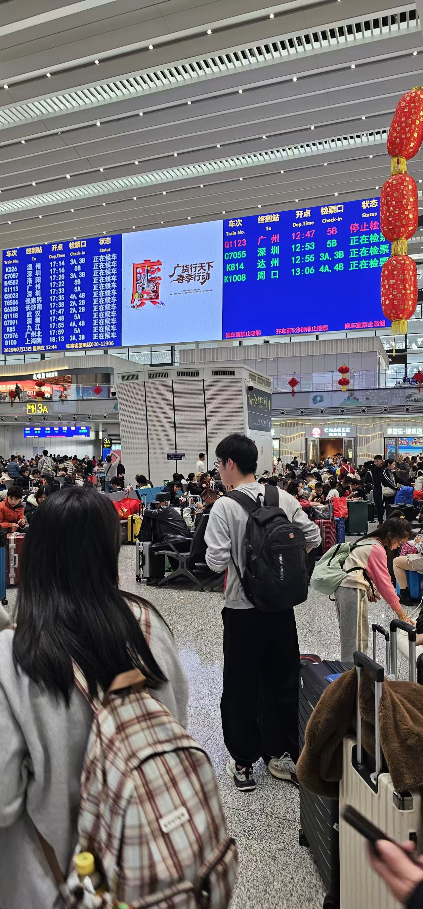

+++
date = '2026-02-13T15:01:01+08:00'
draft = false
title = '回家过年的一些思考'
+++ 

今天早上醒来的是较早的，虽然自己并不对回家抱有多大的期待，至少没把这件事太当回事吧！但奇怪的是，自己的生物钟竟然会因此而受到这么大的影响。往日听不到的闹钟，今早竟然早早地听见了。在往日听到时，自己还能继续“心安理得”地偷睡会儿，但今天的表现完全反了过来。不仅仅是猫一直在打扰我的睡眠，而且自己内心也有一股烦躁劲。

不知道为啥，今年的自己对过年回家这件事没多大的兴致。就像有的人说的那样：今年根本就没有啥过年的气氛。毫不避讳地说：我感觉今年的过年气氛甚至还不如西方的圣诞节气氛浓厚呢。

之所以这般感受，我想或许是受今年奋斗不太如意所致；又或者是受身份转变影响所致；当然也更少不了社会整体经济环境的影响所致吧！综合看来，今年的是对过年的感知也就这样了……没啥负面情绪，更多的是一种内心深处对现实生活的真实表述。

过年回家的旅程较长，尤其是在我选择搭乘列车回家更是如此。前程搭火车，后程搭高铁🚄，算是一组先苦后甜的组合了。搭火车的十几个小时里，我们是硬座。一直要从今天的白天坐到明天的白天才能中转搭高铁🚄回家。

在临近晚上的时候，我的同伴几度劝我去升硬卧来度过接下来的夜晚。我呢，肯定没同意嘛。说：算了，我们正身强力壮之际，不怕。把座位让给更有需要的人……
说着说着我自己反倒感动了起来，其实内心还是沉浸在能省则省的戏份中。“别没苦硬吃了”，同伴几度用这样的话术劝着我。我就跟他讲意志力、讲耐受力、讲毅力。最终他还说没把我说服，摇摇头继续趴在桌子上小憩了起来。

在听歌之余，听到了大学时常常回忆的歌曲时，思绪瞬间拉着自己走了一会走马灯般的流程。恍惚之间意识到原来自己已经毕业了快一年的时间了，就像是做了一场梦一般。既真实又有些虚无缥缈……

当我向左边的窗外看去时，才恍然间发现外面的世界已经彻底黑了下来。再细看时，就看到了自己：额头前早已没了刘海的遮盖。神态相较去年来说，更显成熟些了。整个人看上去似乎也多了几份稳重，对接下来的一年说不上像往年那般的“激情澎湃”，但也略填了几分的自信与可支持的笃定。

回顾过去近一年的社会生活，虽然发现真实的世界与原本的心里预期略有些差别，但不至于那般的绝望。害，那要是这样的话，自己还有啥不可面对的呢？我只是觉得这很好玩。
