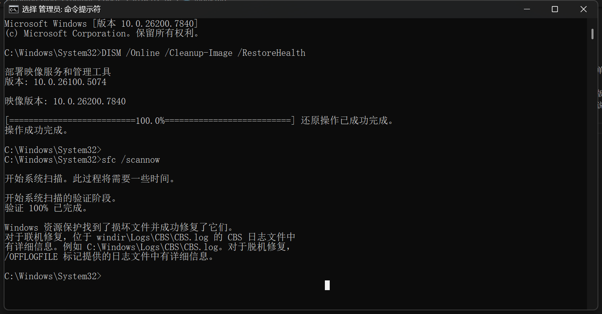

+++
date = '2026-02-26T22:03:01+08:00'
draft = false
title = '不吹不黑，客观描述'
+++ 

今天下午两点多复训完今天的内容课程后，本来把复训中学到的、受到的一些启发和自己的 AI 助理来沟通一下，以此整合和重新修订一下当前的定投清单。结果自己又临时起意，随口问了几个 AI 的问题后，自己便将自己整整一下午的时间投入到与 AI 的交流中。越聊越深入、越聊越开心、越聊越激动、越聊越喜悦。

真的像做到了笑来老师那样，几乎每天都在与 AI 对话，而不是人。在刚开始听到这句话时，我多少有些不当回事，甚至有些疑惑！现在看来，当初那个版本的自己可实在是太 out 了。那种情况现在想起来都有些后背发凉的感觉，因为现在只是不断地慨叹：幸亏现在用起来了，那要是没这样做，自己得错过多少重要的事情啊！说不后怕是假的，不这么说，也会显得我甚为虚伪...

那这个下午具体做了些什么使得我这么激动呢？

>1.对于每次开机时，电脑桌面常常会出现自启动程序页面、打开浏览器时也常常启用多余的页面。这样的状态一直维持了至少一个季度之久，每次开机后必做的事情就是去关闭这些没用的页面。无形无意、不知不觉中，自己花在这些没用的事情上的精力就随着积年累月般的沉淀而显得如山的多。那么这些宝贵的注意力要是全部放在生产上，那现在的自己绝对是另一个版本的吧！至少形态也会高出现在这个版本的自己0.01的型号来；
>
>2.开始建立起来读深度文章的兴致的信心。自己在过去十多天里，通过使用 AI 来为自己解决实际问题和急切需求，都提供了相当宝贵且有深度的建议。不仅一步一步地展示了其调研的过程和引用的文献来源，而且还提供了基于调研报告内容的再追问条件。如果对于调研报告内容存在阅读障碍，那就大胆提出，于是很快又会得出其专业权威的帮助。想要提取摘要，也是一句话的事情。一切的一切问题，在世界顶尖 AI 大模型面前，都能轻松化解。

以上两点只是我举得两个最为基础的实例。如果以上的内容都无法让你感同身受的话，那么我们的价值观暂时还存在有出入。全世界 AI 大模型层出不穷，各种 AI 工具也是琳琅满目、参差不齐地存在着，如果现在在你的日常生活中 AI 仍然不是你的工具之一，那你也确实该反思一下了。如果你想要在未来的日子里过得更好、更加体面些的话，AI 就该是你的“智囊团”：

- 因为它们永远在迭代、甚至迭代速度越来越快；
- 因为它们很忠诚，可以做到 7*24 小时不间断地工作；
- 因为它们很优秀，因为从工具层面来看，它们绝对是无可挑剔般的存在... 